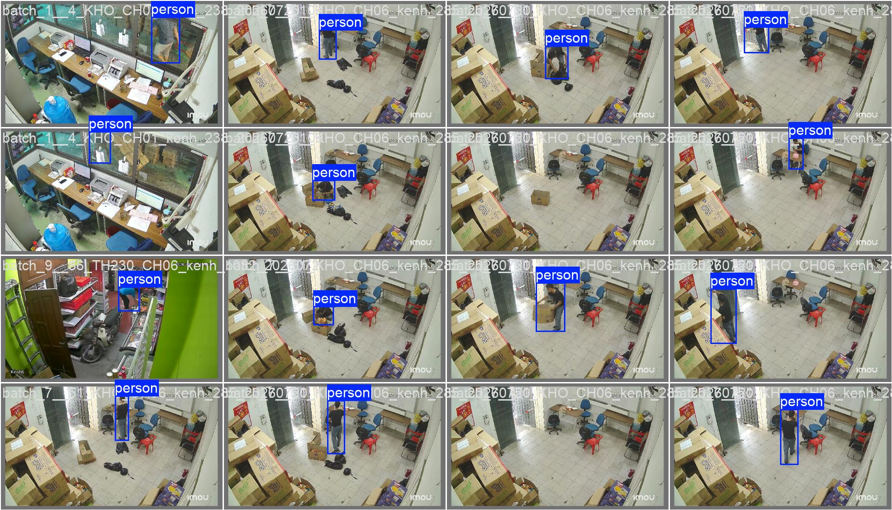
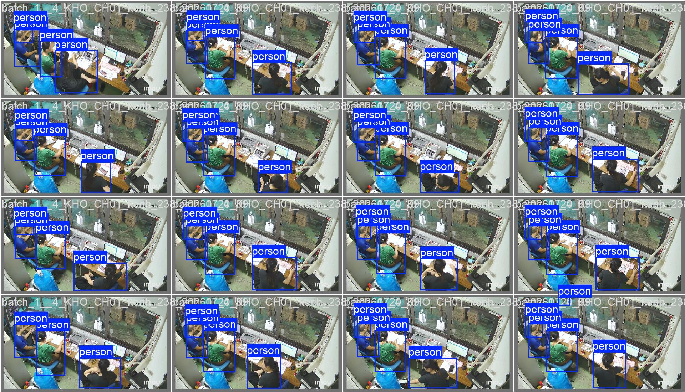
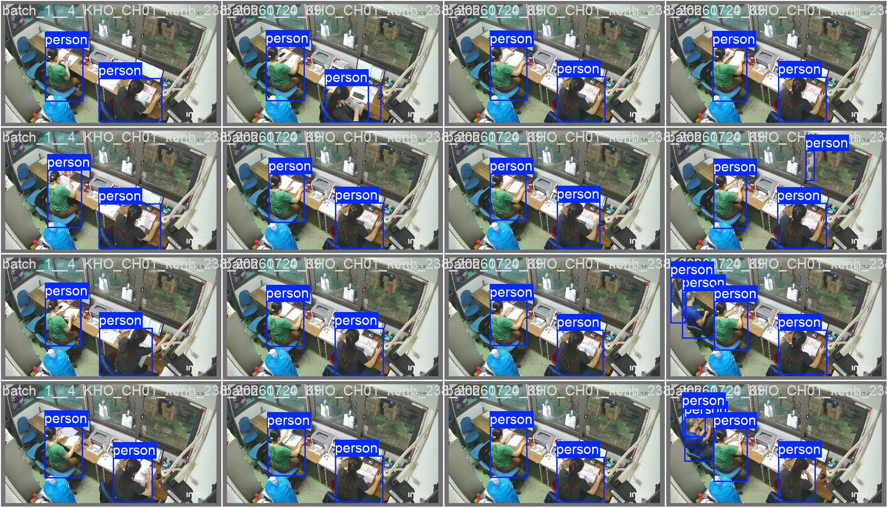

# Processed Data

## Overview

This directory describes the processed dataset used to train and evaluate the object-detection models in the OccluAttnBench_2026 project.

The source frames were reviewed and annotated before being converted into the YOLO object-detection format and divided into training, validation, and test subsets.

## Directory Contents

| File | Description |
|---|---|
| `Sample1.jpg` | Illustration of the data-labeling results. |
| `Sample2.jpg` | Illustration of the data-labeling results. |
| `Sample3.jpg` | Illustration of the data-labeling results. |

The sample images illustrate the labeling results. The blue bounding boxes and `person` labels show how people were annotated in the project images.

## Annotation Process

The extracted images were labelled with **X-AnyLabeling**.

Each visible person was manually annotated using a horizontal bounding box. The annotation process focused on locating people under different conditions, including:

- partial occlusion;
- small and distant objects;
- different camera viewpoints;
- indoor and outdoor environments;
- changing lighting conditions;
- crowded and low-density scenes.

X-AnyLabeling annotation files were stored as `.json` files during the labelling stage. They were subsequently validated, converted, and organised into the YOLO object-detection dataset structure.

## YOLO Annotation Format

The processed annotations use the standard **YOLO horizontal bounding-box object-detection format**.

Each image has a corresponding `.txt` label file. Every annotated object is represented by one line:

```text
class_id x_center y_center width height
```

All bounding-box coordinates are normalised relative to the image width and height, with values between `0` and `1`.

Example:

```text
0 0.62530344 0.79239171 0.22661568 0.40069699
```

The dataset contains one object class:

```text
0: person
```

Images that do not contain a person are retained as negative samples with an empty label file.

## Dataset Structure

The processed dataset follows the Ultralytics YOLO directory structure:

```text
dataset_main/
├── data.yaml
├── images/
│   ├── train/
│   ├── val/
│   └── test/
└── labels/
    ├── train/
    ├── val/
    └── test/
```

The dataset was divided using a fixed random seed of `42`:

- 80% training data;
- 10% validation data;
- 10% test data.

The `data.yaml` configuration defines the dataset paths and the `person` class used by the models.

## Processing Workflow

```text
Extracted image frames
        ↓
Manual annotation with X-AnyLabeling
        ↓
JSON annotation files
        ↓
Validation and conversion
        ↓
YOLO object-detection labels
        ↓
Train, validation, and test split
```

## Sample Visualisations

### Sample 1



### Sample 2



### Sample 3



## Data Availability

The complete processed dataset is not publicly available due to the company's data-protection policy.

The sample images are provided only to illustrate the data-labeling results.
