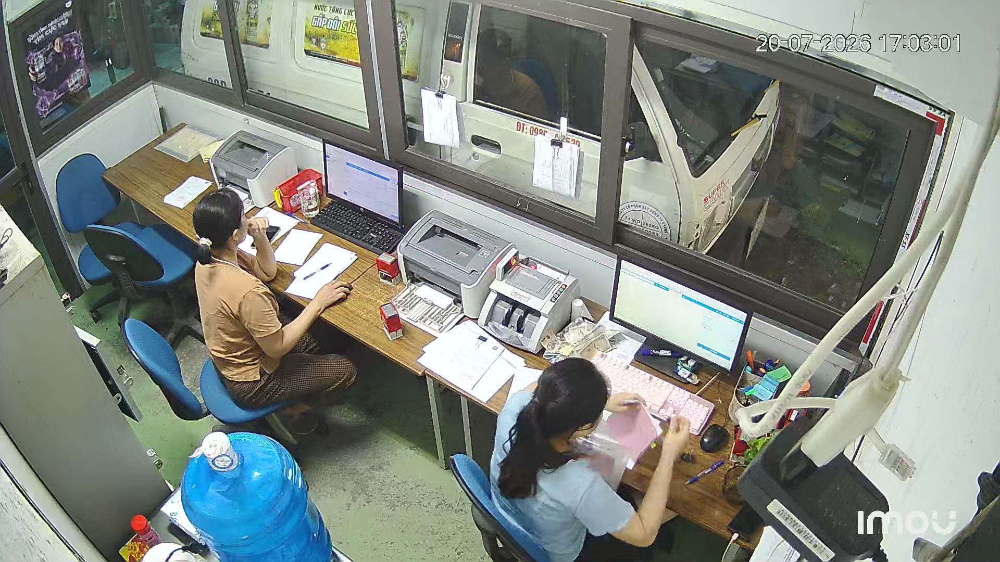
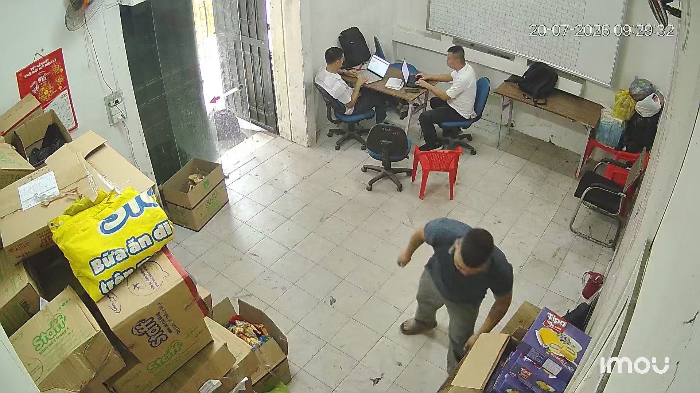
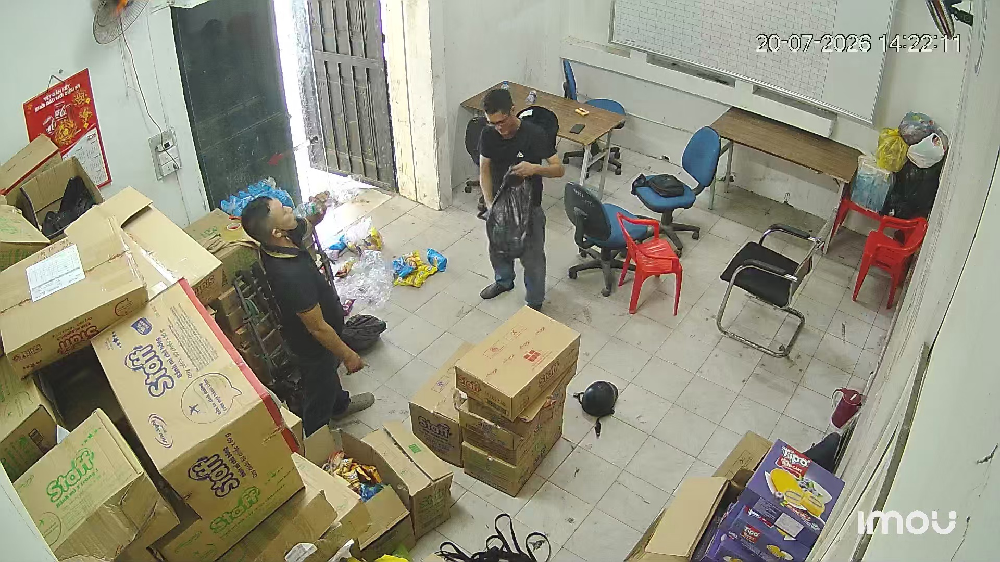
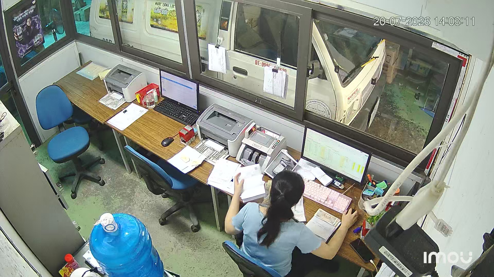
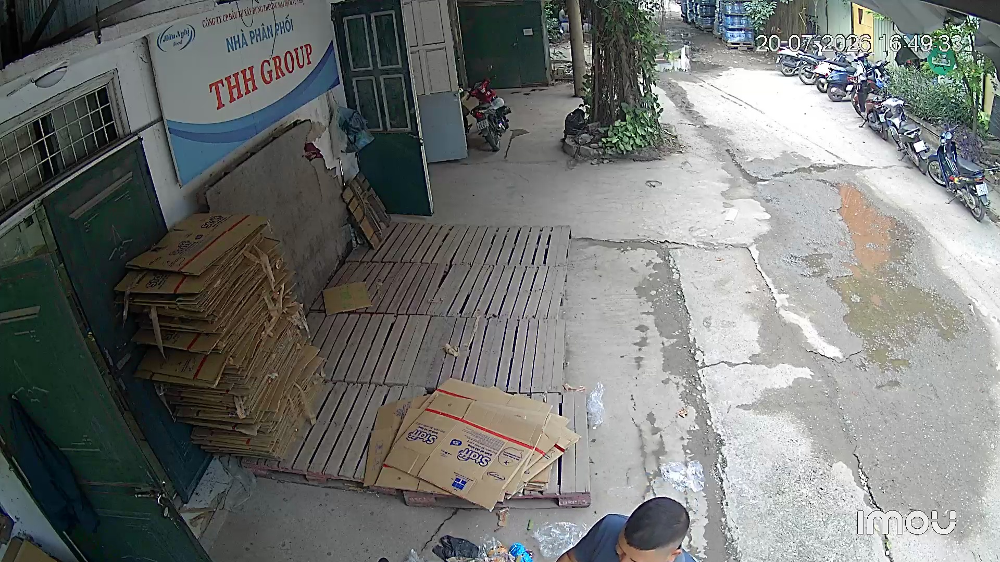

# Data Extraction

## Overview

This directory contains the resources used during the frame-extraction stage of the OccluAttnBench_2026 project.

Source videos were converted into individual image frames before the images were reviewed, selected, annotated, and prepared for the object-detection dataset.

## Directory Contents

| File | Description |
|---|---|
| `extract_frames_cli.py` | Python utility used to extract image frames from source videos with FFmpeg. |
| `Sample1.jpg` | Example frame selected from Batch 3. |
| `Sample2.jpg` | Example frame selected from Batch 7. |
| `Sample3.jpg` | Example frame selected from Batch 8. |
| `Sample4.jpg` | Example frame selected from Batch 2. |
| `Sample5.jpg` | Example frame selected from Batch 5. |

## Extraction Process

```text
Authorised source videos
        ↓
Frame extraction
        ↓
Image review and selection
        ↓
Annotation and dataset preparation
```

The `extract_frames_cli.py` utility automates the conversion of video recordings into individual JPEG frames. It supports common video formats, configurable extraction intervals, batch processing, and basic processing reports.

The utility was developed specifically for the project's existing data-collection workflow and infrastructure.

## Sample Images

Five images were randomly selected from five different data batches. They illustrate the camera viewpoints, working environments, lighting conditions, object scales, and occlusion scenarios present in the project.

The samples are provided for project illustration only and do not represent the complete dataset.

### Sample 1 — Batch 3



### Sample 2 — Batch 7



### Sample 3 — Batch 8



### Sample 4 — Batch 2



### Sample 5 — Batch 5



## Data Availability

Only a limited number of sample images are included to provide an overview of the project data.

The complete source dataset is not publicly available due to the company's data-protection policy.

For additional project context, see the [`raw data` README](../README.md).
